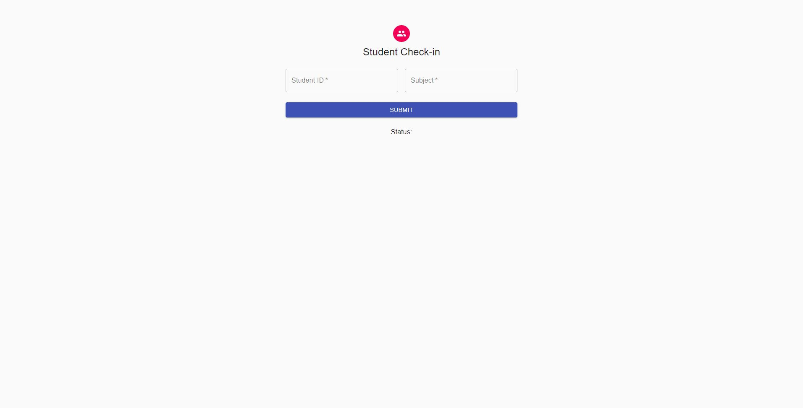
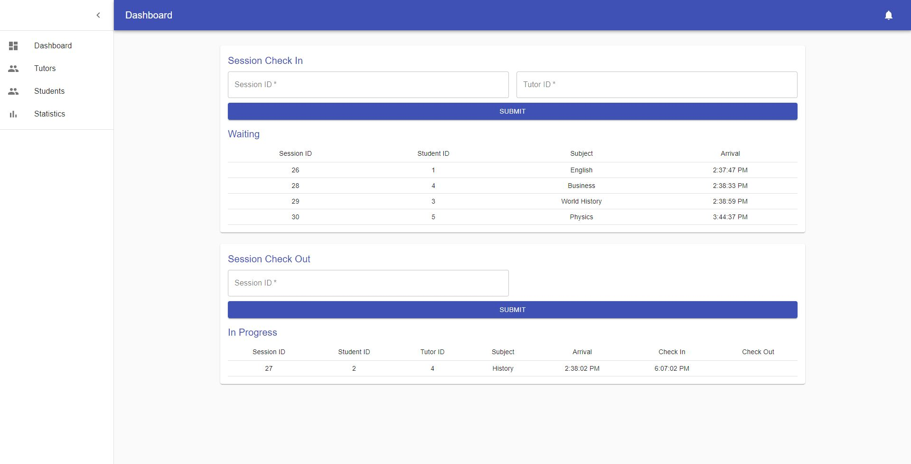
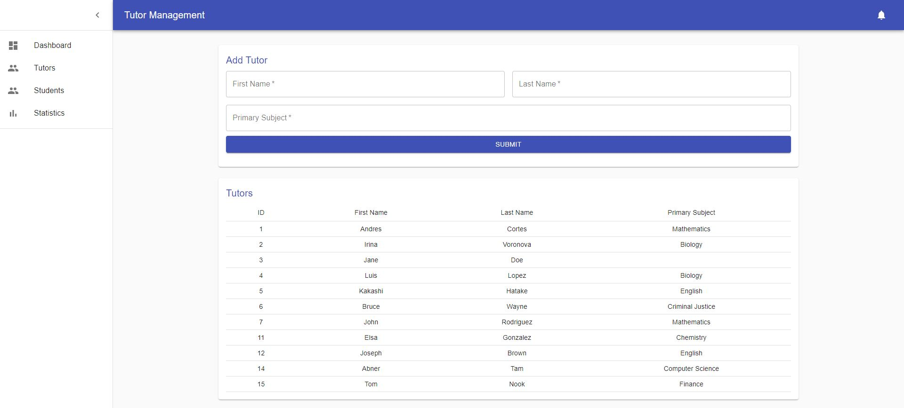
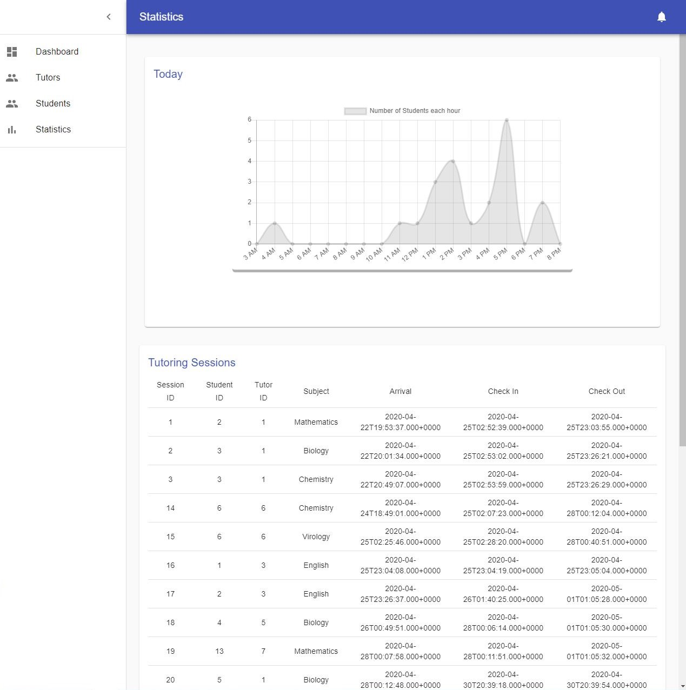

# TutoringCenter
### Final Project For CMPE172 (Spring 2020) at San Jose State University
### by Andres Cortes, Christopher Douglas (@Chrisrdouglas), and Irina Voronova (@IVoronova)

#### Introduction
This application is intended to serve as a check-in/check-out service for tutoring centers. Students can check into the center to notify tutors that they need help. From the employee view of the application, tutors can see all students that are waiting for assistance and check them into a tutoring session. They can then check out these students when the session is over. Employees are also able to view peak check in times and register new students and tutors. In it's current state, there is no authentication so anyone can view any page, but in a complete implementation, employees would need to log in with an id and password. 

#### Sample Screenshots
Student Check-In page


Employee Dashboard page


Tutor Registration and Management page


Statistics page


#### Pre-Requisites
Java 8 or Higher
Maven
A MySQL Client
Node.js and npm
Eclipse IDE with Spring Tools 4 (Spring Tool Suite 4) installed
#### Installation / Local Build
Create a database and build the schema in schema/dbschema.sql. This will create several tables and populate them with sample entries. Download and extract the project into an empty directory. Copy the database url (usually in the format jdbc:mysql://{address here}/{database name here}), username, and password, and paste them in the indicated position in /src/main/resources/application.properties. From the root folder, run the following:
```
mvn clean
mvn package
java -jar target/springboot-0.0.1-SNAPSHOT.jar
```
The above will run both the front and backend, you can view the application at localhost:8080. If you wish to run the frontend and backend separately for development, do the following:
1. Create the database and copy the credentials into application.properties as indicated above
2. In Eclipse, File> Import> Maven> Existing Maven Projects> Next and navigate to the the root directory of this project, and click Finish
3. Right click the project in the Package Explorer on the right and run as a Spring Boot App (Spring Tools 4 must be installed as an Eclipse plugin). The console should log the time to build and the port where the Application is running on. The backend is now running, and we can test it through Postman or the browser directly.
4. Navigate to /frontend in the command line, Run `npm install` and `npm start`. The frontend will now be running on port 3000, and will communicate with springboot through API calls on port 8080. 
#### UML Diagrams

#### Schema
The schema for the database is available in schema/dbschema.sql
#### Database Queries
Database Queries are made through JPA. The entity models are available in src/main/java/edu/sjsu/cmpe172/TutoringCenter/model, while the data access objects are available in ''/DAO, the services in ''/service, and the controllers in ''/controller. You can query the database using MySQL through your choice of MySQL client. For this project, we used MySQL Workbench to initially test the database.
#### Mid Tier API
The mid tier API is created in src/main/java/edu/sjsu/cmpe172/TutoringCenter/controller. For example, the API for retrieving all tutors is created in src/main/java/edu/sjsu/cmpe172/TutoringCenter/controller/TutorController.java. Here we can see that GET is mapped to /api/tutor. So we can send a GET request to /api/tutor.
#### UI Data Transport
When making a request that necessitates a body (i.e. a POST), the body will be in the form of a JSON. This can be seen in frontend/src/components/addtutor.js, where a method is called when the submit button is clicked that will populate a JSON object.
#### References
https://medium.com/@mukundmadhav/build-and-deploy-react-app-with-spring-boot-and-mysql-6f888eb0c600#b282
https://medium.com/@wkrzywiec/how-to-put-your-java-application-into-docker-container-5e0a02acdd6b
https://developer.okta.com/blog/2018/07/19/simple-crud-react-and-spring-boot
